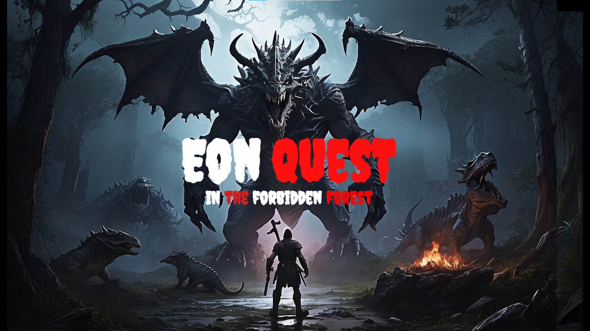

# EON QUEST: IN THE FORBIDDEN FOREST

"Eon Quest" is rooted in a high-fantasy theme, blending elements of magic, adventure, and exploration. The game draws inspiration from classic fantasy literature, immersing players in a world filled with mythical creatures, ancient artifacts, and the clash between elemental forces. The ambiance is both mysterious and awe-inspiring, creating a sense of wonder as players journey through the fantastical realms of Eon.

## Disclaimer

This project is being released as-is and targeted towards more testing users. It does not reflect current best practices nor is it perfectly optimized.

## How to install and run the game

- [How to install core and launch](https://support.coregames.com/hc/en-us/articles/360044766613-Installing-Launching-Core)
- After installing the core game engine from unreal engine, [click here](https://www.coregames.com/games/fbc99e/mayadweepam) to play the game.

## Objective 

The central objective of "Eon Quest" is for the player to find the lost artifact—a powerful green weapon—hidden within the diverse landscapes of Eon. The hero's mission is not only a personal quest for glory but also a noble endeavor to prevent the misuse of the artifact's immense power. To achieve this goal, players must navigate through perilous terrains, solve intricate puzzles, and confront a variety of enemies, including skull-headed demons with elemental powers and colossal dragons.

## Creative Aspects:

- World Design:
  The world of Eon is intricately designed, featuring visually stunning landscapes that reflect the elemental themes of fire, earth, and ice. Each region has         its own distinct flora and fauna, contributing to a sense of immersion and diversity.

- Character Design:
  The protagonist is a relatable yet valiant character, allowing players to project themselves into the fantasy world. The enemies, including skull-headed            demons and dragons, are creatively crafted with intricate details to make each encounter memorable.

- Artifact Design:
  The green weapon is a focal point of the game's aesthetic appeal. Its design should exude an otherworldly, ethereal quality, reflecting the potent magic it 
  possesses. The weapon's visual effects and animations should be captivating, making it a symbol of both danger and hope.

- Soundtrack:
  The game's soundtrack complements the immersive experience, dynamically changing to match the tone of the gameplay. From haunting melodies in mysterious          caverns to epic orchestrations during dragon battles, the music enhances the emotional depth of the player's journey.

- Narrative Depth:
  The game weaves a compelling narrative, incorporating ancient lore, forgotten prophecies, and the moral implications of possessing such a powerful artifact. 
  The storyline unfolds gradually, keeping players engaged and invested in the world of Eon.

- Environmental Interaction:
  Environmental elements play a crucial role in both exploration and combat. Dynamic weather conditions, interactive puzzles, and destructible elements add         layers to the gameplay, encouraging strategic thinking and enhancing the overall gaming experience.

##  Features in "Eon Quest"

- Weapon Variety:
  The game boasts a diverse selection of weapons available for the player to choose from at the start. Ranging from swords and bows to magical staffs, each         weapon has its strengths and weaknesses. Players must strategically select the right weapon for the type of demon they encounter.
   
- Demon Diversity:
  Leveraging the community content NPC kit, "Eon Quest" introduces a variety of demons, each with unique attributes and abilities. Some demons may have higher      health but move slower, while others may be more agile but have lower health. This diversity adds depth to combat and requires players to adapt their 
  strategies.
  
- Health and Weakness System:
  Demons in the game possess different health levels and vulnerabilities. Some demons may be resistant to physical attacks but susceptible to magic, while others 
  might have elemental weaknesses. Players need to analyze and exploit these weaknesses to efficiently defeat the demons.
  
- Community-Sourced Assets:
  "Eon Quest" embraces community content by utilizing assets from NPC kits, project content, and other sources. This not only enriches the visual and auditory   
   aspects of the game but also fosters a collaborative and diverse game development community.

- Temple Exploration:
  The temples, obtained from community content, serve as key locations in the quest. Players must explore these ancient structures, solving puzzles and   
  overcoming challenges to progress in their search for the lost artifact. The temples also provide a rich backdrop for uncovering the lore of Eon.
  
- Terrain Design:
  The expansive terrain, painted with lush grass and featuring foliage such as trees, skulls, and mushrooms, creates an immersive and visually appealing   
  environment. The 1024*1024 dimension allows for expansive landscapes, enhancing the sense of exploration and discovery.
  
- Portal Mechanics:
  The portal, acquired from project content, serves as the gateway between worlds. It not only facilitates the protagonist's arrival in Eon but also plays a 
  pivotal role in the narrative. As players progress, they may discover additional portal-related mechanics that influence gameplay.

- Interactive Environment:
  The game encourages players to interact with the environment strategically. Whether it's using the terrain for cover during battles, discovering hidden 
  pathways in temples, or utilizing the portal for tactical advantages, the environment is more than just a backdrop—it's an integral part of the gaming 
  experience.
  
- Dynamic Lighting and Weather:
  The game employs dynamic lighting and weather effects to enhance the visual experience. As players traverse different regions of Eon, they'll encounter varying 
  lighting conditions, from the fiery glow of the demon-guarded landscapes to the serene ambiance of the icy realms.
  
- Player Progression and Upgrades:
  As the player advances, they can earn experience points and discover or unlock new weapons and abilities. This progression system adds a layer of depth to the    gameplay, rewarding players for their exploration and combat achievements.

## Project Structure

 

## License

Licensed under the [Apache License 2.0](LICENSE) license.
